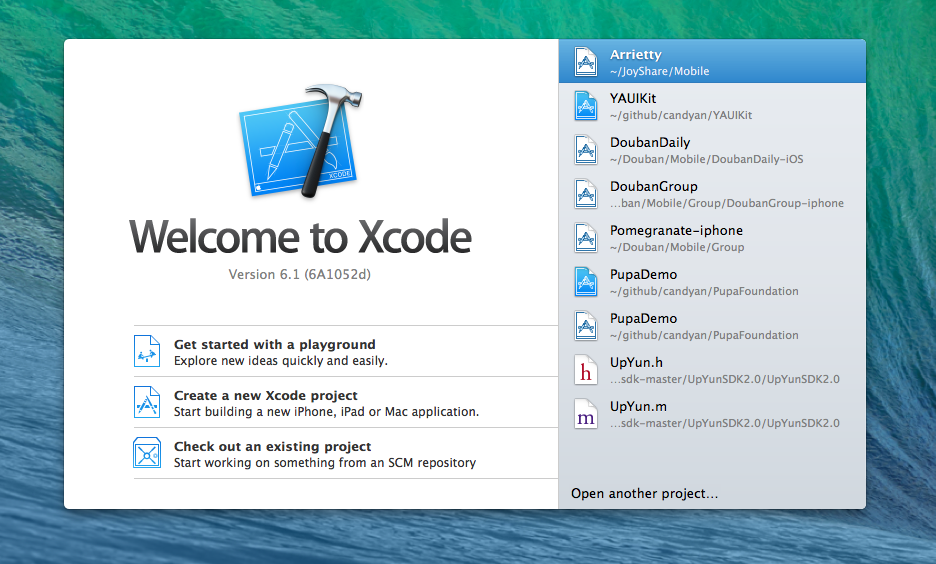
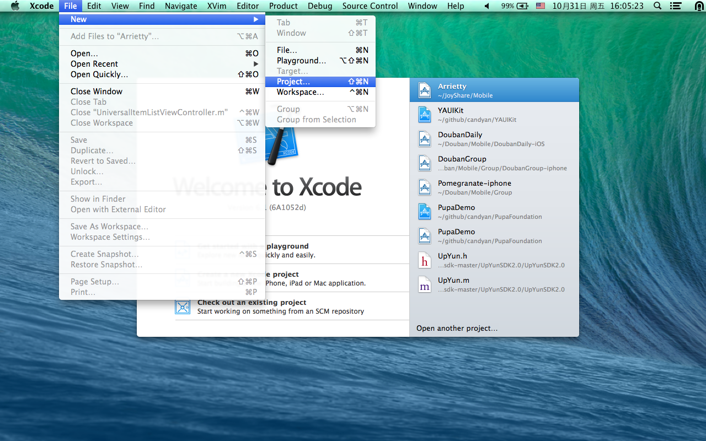
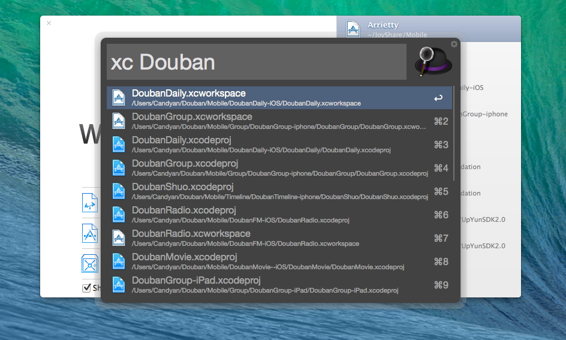
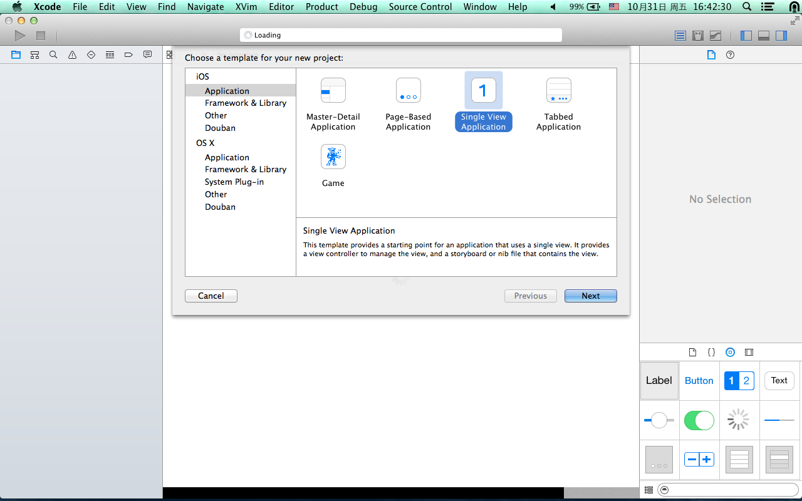
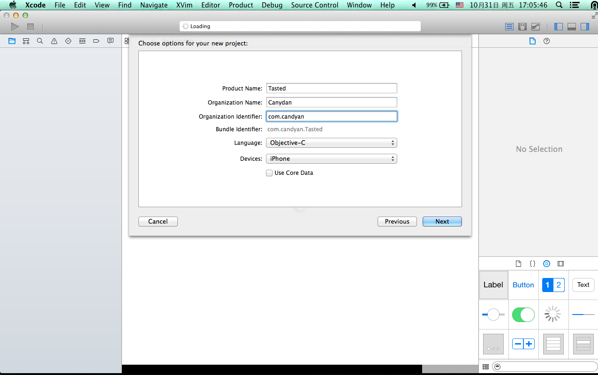
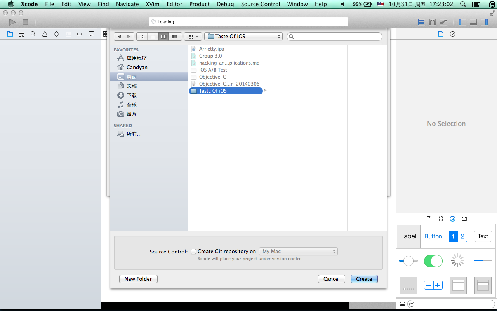
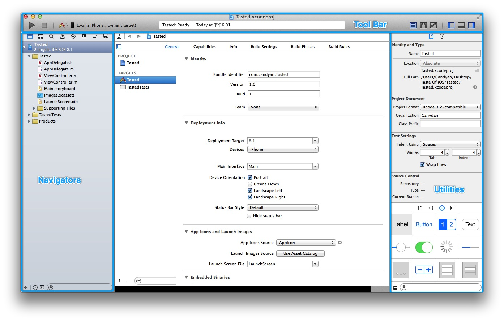

#2.1 创建工程

在开始写我们的应用之前，我们先要有个应用。就像你建房子之前，要先找一个地方，然后打地基一样。所以在这个小节各种，我来介绍一下如何来创建一个你写应用的地方。

### 创建应用

首先让我们打开 Xcode，如果一切正常的话，应该会出现下面的画面。

窗口被分成了两个区域：右侧是你最近打开过的工程，左侧是你可以创建工程。你可以通过点击Create a new Xcode project 来创建一个新的工程也可以像下图一样：

点击 File -> New -> Project... 来创建一个新的工程。当然了用上图的快捷键也是可以的。

>
> TIPS：想要查找和快速打开一个你的 Xcode 工程，我推荐使用 [Alfred](http://www.alfredapp.com/) 的 [Open Xcode Projects](resouces/Open-Xcode-Projects.alfredworkflow) workflow。它可以搜索并打开相应的工程。
> 
> 

如果上述步骤木有问题，那么你应该看到了下图的界面：

这个窗口也是被分成了两个区域：左侧是工程模板的分类列表，每一种工程模板分类里面都有一些工程模板供你选择。当然你也可以添加属于自己的工程模板分类，比如上图的 Douban 就是添加进去的；右侧是这个分类下面的具体的工程模板，你可以选择一个来创建你的工程。

通常，我会选择Single View Application 模板。因为这个模板足够的简单，没有多余的东西，可以轻松的变成其他几类目标的样子，方便我们对工程的结构做优化和扩展。当然每个模板下面都有相应的介绍，你也可以选择适合自己的工程模板。

>
> TIPS：如何创建工程模板和文件模板，我们会在后面详细的讨论。
>

好，让我们选择 Single View Application 模板。之后会进入下图：

在这里会让你填写应用的一些信息和配置。这里就木有什么好说的了，我们直接 Next。

>
> TIPS：
> 
> 1. Bundle Identifier 在这里是自动生成的，创建应用后可以更改。
> 2. Langage 尽量选择 Objective-C 除非你确定你只使用 Swift。因为如果你在一个 Objective-C 工程里面添加 Swift 文件，Xcode 会自动帮你生成 xxx-Bridging-Header.h 和相应的配置；但是如果你是一个 Swift 工程，你要想添加一个 Objective-C 文件，那就只能靠你自己了。 关于 Objective-C 和 Swift 混编的事情，我们在后面也会讨论到。
>

随后就会让你选择一个目录来创建你的工程了，这个也木有什么好说的了。

然后大功告成。已经创建好了我们的应用啦！

这个时候我们已经有了一个可以供我们发挥的地方啦。下面我们来看下一个具体工程的Xcode界面里面都有些什么：

上图已经标出了各个地方叫什么名字，大家可以在 View 菜单中找到对应的选项。那么每个区域都有啥作用哪？

- ToolBar：里面包括应用的运行、停止；Scheme编辑；应用状态的显示；窗口的调整- 。
- Navigators：是一个导航器，包括了文件导航、搜索结果导航、类导航、error导航、断点导航、测试导航、Debug导航。
- Utilities：是一个工具窗口，里面包含了很多功能，对于不同的文件类型有着不同的操作功能。

当然了，中间的最大的区域就是我们最主要的工作区域——编辑区，之后我们大部分的工作都是在这里面完成的。

>
> TIPS：
> 
> 1. 文件导航里面的目录结构并不一定跟文件系统的目录结构是一样的。例如：你在 Xcode 中建立一个文件夹（Xcode 中叫做 Group），但是在实际的文件系统中并不会建立一个相应的文件夹。这里建议文件导航的目录结构最好跟文件系统的目录结构一一对应。在建立 Group 的时候，最好先在文件系统中建立一个文件夹，然后再把这个文件夹添加到文件导航里面当做一个 Group。
> 
> 2. 文件导航里面的文件并不一定都是App要用到的文件，所以其实一个工程里面可以包含很多个应用的文件。具体每个应用要使用那些文件，是要到相应的 `Target` 中的添加和定义的，这个在后面会有具体的介绍。
>

##Links
- [目录](preface.md)
- 上一节: [应用搭建](02.0.md)
- 下一节: [应用配置和项目结构](02.2.md)
